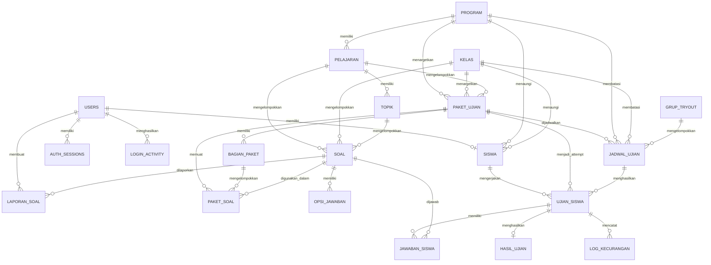
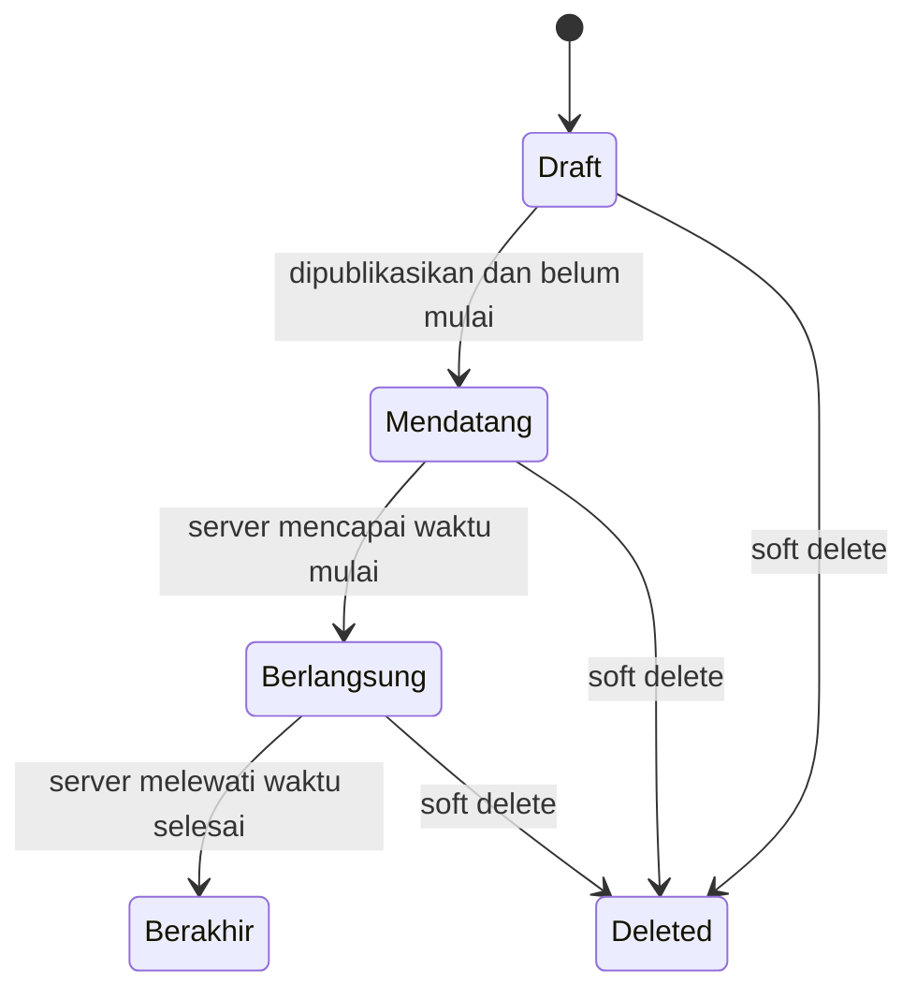
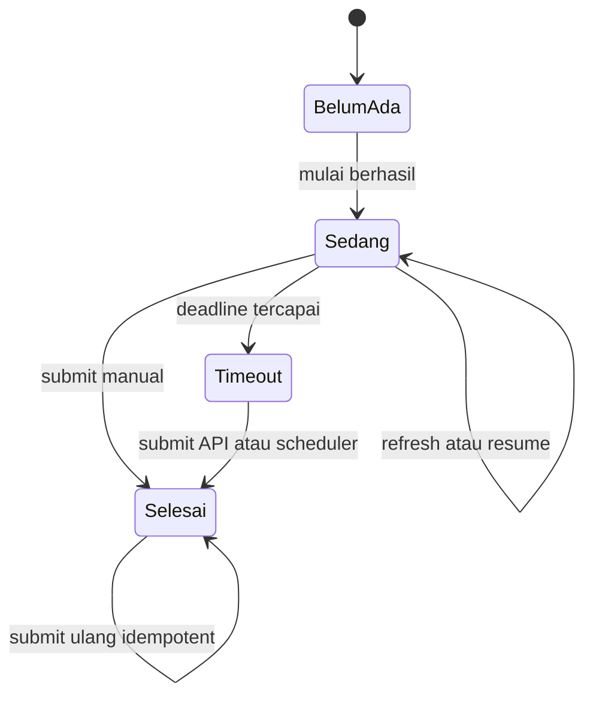
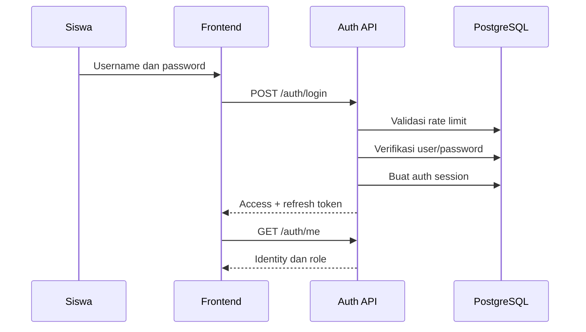

# PRD Siswa: Backend, Database, dan Alur Produk

## Quantum Research CBT

| Informasi | Nilai |
|---|---|
| Versi | 1.0 |
| Tanggal | 10 September 2026 |
| Ruang lingkup | Produk siswa, kontrak backend, database, dan aturan bisnis |
| Target pembaca | Product designer, UI/UX designer, frontend engineer, dan AI pembuat PRD frontend siswa |
| Sumber kebenaran | Implementasi backend, ORM model, schema API, service, dan migration aktif |

> Dokumen ini menjadi sumber kebenaran untuk merancang frontend siswa. Jangan menambahkan field, status, fitur, atau aturan bisnis yang tidak tercantum tanpa perubahan backend dan persetujuan product owner.

---

## 1. Ringkasan Produk

Quantum Research CBT adalah sistem ujian berbasis web untuk siswa bimbingan belajar Quantum Research.

Dari perspektif siswa, sistem mendukung:

- Login menggunakan akun yang dibuat administrator.
- Melihat profil, program, dan kelas.
- Melihat ujian, latihan, dan speedtest yang sesuai dengan program dan kelas siswa.
- Mengetahui status jadwal: mendatang, berlangsung, atau berakhir.
- Memulai satu attempt untuk satu jadwal.
- Melanjutkan attempt yang belum selesai.
- Mengerjakan soal dengan urutan soal dan opsi yang disimpan server.
- Menjawab lima jenis soal.
- Menandai soal sebagai ragu-ragu.
- Menyimpan jawaban otomatis dan memulihkan draft.
- Mengikuti timer yang ditentukan server.
- Submit manual atau otomatis ketika waktu habis.
- Melihat riwayat ujian dan nilai.
- Melihat kunci serta pembahasan setelah ujian selesai.
- Melaporkan soal bermasalah.
- Mengganti password dan logout.

---

## 2. Tujuan dan Non-Goals

### 2.1 Tujuan utama

1. Siswa hanya menemukan ujian yang diperuntukkan baginya.
2. Siswa dapat mengerjakan ujian secara stabil di desktop dan mobile.
3. Jawaban tidak hilang ketika berpindah soal, refresh, atau koneksi terputus sementara.
4. Waktu ujian tidak dapat dimanipulasi dari browser.
5. Kunci dan pembahasan hanya dapat dilihat setelah attempt disubmit.
6. Attempt, jawaban, timer, dan hasil mengacu pada data server.
7. Siswa tidak dapat mengakses data milik siswa lain.

### 2.2 Non-goals frontend siswa

Frontend siswa tidak menyediakan:

- Pendaftaran akun mandiri.
- Perubahan program, kelas, nomor induk, atau user ID.
- Pembuatan soal, paket, grup, atau jadwal.
- Koreksi nilai.
- Monitoring siswa lain.
- Manajemen pengguna dan pengaturan sistem.
- Join atau leave grup tryout.

---

## 3. Persona dan Otorisasi

### 3.1 Identitas siswa

Siswa terdiri atas dua entitas:

1. `users`: identitas login dan keamanan akun.
2. `siswa`: profil akademik.

Relasi:

```text
siswa.user_id = users.id
```

Akun `role = siswa` tanpa profil siswa dapat login, tetapi endpoint siswa akan mengembalikan:

```http
404 Siswa profile not found
```

### 3.2 Siswa boleh

- Login, refresh token, logout, dan mengganti password.
- Membaca identitas serta profil sendiri.
- Mengubah nama lengkap sendiri.
- Melihat jadwal yang eligible.
- Memulai atau melanjutkan attempt sendiri.
- Membaca soal dan menyimpan jawaban attempt sendiri.
- Mengosongkan jawaban.
- Menandai ragu-ragu.
- Membaca sisa waktu server.
- Mengirim log kecurangan untuk attempt sendiri.
- Submit attempt sendiri.
- Melihat hasil dan pembahasan setelah submit.
- Melaporkan soal.

### 3.3 Siswa tidak boleh

- Mengubah `user_id`, `no_induk`, `program_id`, atau `kelas_id`.
- Membuat attempt melalui endpoint generik staff.
- Membaca attempt, jawaban, hasil, atau log siswa lain.
- Melihat kunci jawaban saat attempt aktif atau belum disubmit.
- Melihat jadwal unpublished/terhapus atau daftar pesertanya.
- Mengakses fungsi admin/guru.

---

## 4. Diagram Relasi Database



---

## 5. Definisi Entitas

### 5.1 `users`

| Field | Keterangan |
|---|---|
| `id` | Primary key user |
| `username` | Nama login unik, maksimal 100 karakter |
| `password_hash` | Password yang telah di-hash |
| `role` | `admin`, `guru`, atau `siswa` |
| `is_active` | Status akun |
| `token_version` | Versi token untuk mencabut seluruh sesi |
| `created_at` | Waktu pembuatan akun |

Tidak tersedia: email, telepon, avatar, login sosial, OTP, atau verifikasi email.

### 5.2 `auth_sessions`

| Field | Keterangan |
|---|---|
| `id` | Primary key |
| `user_id` | Pemilik session |
| `jti_hash` | Hash ID refresh token |
| `family_id` | Keluarga token hasil rotasi |
| `expires_at` | Waktu kedaluwarsa |
| `revoked_at` | Waktu pencabutan |
| `replaced_by_hash` | Token pengganti |
| `created_at` | Waktu session dibuat |

Aturan:

- Access token berumur pendek.
- Refresh token berlaku sekitar tujuh hari.
- Refresh token dirotasi setiap digunakan.
- Token lama tidak boleh digunakan kembali.
- Logout mencabut refresh session.
- Ganti password mencabut seluruh session user.

### 5.3 `siswa`

| Field | Keterangan |
|---|---|
| `id` | Primary key siswa |
| `user_id` | Relasi ke `users.id` |
| `nama_lengkap` | Nama lengkap |
| `no_induk` | Nomor induk unik, nullable |
| `program_id` | Relasi program, nullable |
| `kelas_id` | Relasi kelas, nullable |

Siswa hanya boleh mengubah `nama_lengkap`.

Tidak tersedia: foto, alamat, gender, tanggal lahir, sekolah asal, WhatsApp, orang tua, tahun akademik, atau keanggotaan grup.

### 5.4 `program`

| Field | Keterangan |
|---|---|
| `id` | Primary key |
| `nama` | Nama program |
| `deskripsi` | Deskripsi, nullable |
| `is_active` | Status aktif |

Program menjadi salah satu dasar eligibility jadwal.

### 5.5 `kelas`

| Field | Keterangan |
|---|---|
| `id` | Primary key |
| `nama` | Nama kelas |

Tidak tersedia tingkat, tahun ajaran, wali kelas, program kelas, atau status aktif.

### 5.6 `pelajaran`

| Field | Keterangan |
|---|---|
| `id` | Primary key |
| `nama` | Nama pelajaran |
| `program_id` | Program terkait, nullable |

Digunakan untuk metadata soal, paket, bagian, dan breakdown hasil.

### 5.7 `topik`

| Field | Keterangan |
|---|---|
| `id` | Primary key |
| `pelajaran_id` | Relasi pelajaran |
| `nama` | Nama topik/bab |
| `is_active` | Status aktif |

Topik adalah metadata bank soal dan tidak dijamin tersedia dalam response soal aktif.

### 5.8 `paket_ujian`

| Field | Keterangan |
|---|---|
| `id` | Primary key |
| `nama` | Nama paket |
| `deskripsi` | Deskripsi paket |
| `durasi_menit` | Durasi dasar paket |
| `jumlah_soal` | Jumlah soal konfigurasi |
| `is_random_soal` | Randomisasi urutan soal |
| `is_random_opsi` | Randomisasi urutan opsi |
| `pelajaran_id` | Pelajaran utama, nullable |
| `kelas_id` | Target kelas, nullable |
| `program_id` | Target program |
| `tipe` | `ujian`, `latihan`, atau `speedtest` |

Jangan mengasumsikan passing grade, harga, sertifikat, negative marking, bobot per soal, waktu per soal, atau batas attempt berdasarkan tipe.

### 5.9 `bagian_paket`

| Field | Keterangan |
|---|---|
| `id` | Primary key |
| `paket_ujian_id` | Parent paket |
| `nama` | Nama bagian |
| `urutan` | Urutan bagian |
| `durasi_menit` | Metadata durasi, nullable |
| `pelajaran_id` | Pelajaran bagian, nullable |
| `is_random_soal` | Preferensi randomisasi |
| `is_random_opsi` | Preferensi randomisasi opsi |
| `deskripsi` | Deskripsi bagian |

Belum ada timer per bagian, bagian terkunci, submit per bagian, atau larangan kembali ke bagian sebelumnya.

### 5.10 `paket_soal`

| Field | Keterangan |
|---|---|
| `paket_ujian_id` | Parent paket |
| `soal_id` | Soal yang digunakan |
| `urutan` | Urutan default |
| `bagian_paket_id` | Bagian paket, nullable |

Satu soal hanya boleh muncul sekali dalam satu paket, tetapi dapat digunakan di paket lain.

### 5.11 `soal`

| Field | Keterangan |
|---|---|
| `id` | Primary key |
| `pelajaran_id` | Pelajaran |
| `kelas_id` | Kelas |
| `topik_id` | Topik |
| `teks_soal` | Konten HTML/LaTeX |
| `tipe` | Jenis soal |
| `gambar_url` | URL gambar, nullable |
| `tingkat_kesulitan` | Nilai 1-100 |
| `kunci_jawaban` | Kunci isian |
| `pembahasan` | Pembahasan soal |

Jenis soal:

```text
pilihan_ganda
pilihan_lebih_dari_satu
benar_salah
esai
isian
```

Saat attempt aktif, frontend tidak boleh menerima atau menampilkan kunci, `is_benar`, dan pembahasan.

### 5.12 `opsi_jawaban`

| Field | Keterangan |
|---|---|
| `id` | Primary key |
| `soal_id` | Parent soal |
| `teks_opsi` | Teks/HTML opsi |
| `is_benar` | Penanda kunci |
| `urutan` | Urutan default |
| `pembahasan` | Pembahasan opsi, nullable |

### 5.13 `grup_tryout`

| Field | Keterangan |
|---|---|
| `id` | Primary key |
| `nama` | Nama grup/gelombang |
| `deskripsi` | Deskripsi |
| `is_active` | Status |
| `created_at` | Waktu pembuatan |

Tidak ada tabel keanggotaan siswa-grup. Grup hanya mengategorikan jadwal. Jangan membuat fitur “grup saya”, join grup, atau leave grup.

### 5.14 `jadwal_ujian`

| Field | Keterangan |
|---|---|
| `id` | Primary key |
| `paket_ujian_id` | Paket terjadwal |
| `mulai` | Waktu mulai |
| `selesai` | Waktu selesai jadwal |
| `is_published` | Boleh ditemukan siswa |
| `program_id` | Batas program, nullable |
| `kelas_id` | Batas kelas, nullable |
| `grup_tryout_id` | Kategori grup, nullable |
| `is_deleted` | Soft delete |
| `durasi_menit_paket` | Snapshot/override durasi |

Eligibility siswa:

1. `is_published = true`.
2. `is_deleted = false`.
3. Program cocok atau jadwal tidak membatasi program.
4. Kelas cocok atau jadwal tidak membatasi kelas.

### 5.15 `ujian_siswa`

| Field | Keterangan |
|---|---|
| `id` | Primary key attempt |
| `siswa_id` | Pemilik |
| `paket_ujian_id` | Paket |
| `jadwal_ujian_id` | Jadwal asal |
| `started_at` | Waktu mulai server |
| `finished_at` | Waktu selesai |
| `is_submitted` | Status submit |
| `soal_urutan` | Array ID soal final |
| `opsi_urutan` | Mapping soal ke urutan opsi |
| `bagian_urutan` | Snapshot urutan bagian dan soal |

Aturan produk: satu siswa hanya boleh memiliki satu attempt untuk satu jadwal.

Snapshot yang tersimpan: ID/urutan soal, ID/urutan opsi, dan bagian. Teks, kunci, pembahasan, deadline immutable, dan aturan scoring belum disnapshot.

### 5.16 `jawaban_siswa`

| Field | Keterangan |
|---|---|
| `id` | Primary key |
| `ujian_siswa_id` | Parent attempt |
| `soal_id` | Soal |
| `jawaban` | Isi jawaban |
| `submitted_at` | Timestamp insert pertama |
| `is_ragu` | Penanda ragu-ragu |
| `skor_manual` | Nilai manual 0-100 |
| `dinilai_oleh` | User penilai |
| `dinilai_at` | Waktu penilaian |

Constraint:

```text
UNIQUE (ujian_siswa_id, soal_id)
```

Format jawaban:

| Jenis | Format |
|---|---|
| Pilihan ganda | ID opsi sebagai string |
| Benar/salah | ID opsi sebagai string |
| Multi-select | JSON array ID opsi dalam text |
| Esai | Text |
| Isian | Text |

Esai/isian dan multi-select dapat dikosongkan kembali.

### 5.17 `hasil_ujian`

| Field | Keterangan |
|---|---|
| `id` | Primary key |
| `ujian_siswa_id` | Attempt unik |
| `skor` | Nilai total 0-100 |
| `skor_per_pelajaran_json` | Breakdown nilai |
| `calculated_at` | Waktu perhitungan |

Contoh:

```json
{
  "12": {
    "pelajaran_id": 12,
    "nama": "Matematika",
    "jumlah_soal": 10,
    "jumlah_benar": 7,
    "skor": 70
  },
  "_meta": {
    "esai_belum_dinilai": 2,
    "menunggu_koreksi": true
  }
}
```

### 5.18 `log_kecurangan`

| Field | Keterangan |
|---|---|
| `id` | Primary key |
| `ujian_siswa_id` | Attempt |
| `tipe_kecurangan` | Jenis event |
| `deskripsi` | Deskripsi |
| timestamp | Waktu kejadian |

Event frontend yang jelas saat ini hanya `tab_blur`. Jangan mengasumsikan kamera, mikrofon, deteksi wajah, screenshot, screen recording, perangkat kedua, atau deteksi DevTools.

### 5.19 `laporan_soal`

| Field | Keterangan |
|---|---|
| `id` | Primary key |
| `soal_id` | Soal yang dilaporkan |
| `user_id` | Pelapor |
| `alasan` | Alasan |
| `status` | Default `baru` |
| timestamp | Waktu laporan |

Siswa belum dapat melihat daftar atau status laporan miliknya.

---

## 6. State Machine Jadwal



```text
Jika is_deleted = true: tidak terlihat
Jika is_published = false: tidak terlihat
Jika mulai > now: mendatang
Jika selesai < now: berakhir
Selain itu: berlangsung
```

| Status | Terlihat | Bisa mulai |
|---|---:|---:|
| Draft/unpublished | Tidak | Tidak |
| Deleted | Tidak | Tidak |
| Mendatang | Ya | Tidak |
| Berlangsung | Ya | Ya |
| Berakhir | Ya | Tidak |

---

## 7. State Machine Attempt



```text
Jika is_submitted = true: selesai
Jika sekarang >= deadline: timeout
Selain itu: sedang
```

| Operasi | Sedang | Timeout | Selesai |
|---|---:|---:|---:|
| Baca soal | Ya | Tidak | Tidak |
| Simpan jawaban | Ya | Tidak | Tidak |
| Ubah ragu | Ya | Tidak | Tidak |
| Baca state | Ya | Ya | Ya |
| Baca sisa waktu | Ya | Ya, nol | Ya |
| Kirim log | Ya | Ya | Ya |
| Submit | Ya | Ya | Idempotent |
| Lihat kunci | Tidak | Tidak sebelum submit | Ya |

---

## 8. Alur Siswa End-to-End

### 8.1 Login dan session



Error: `401 Invalid credentials`, `429 Too many login attempts`, atau `422`. Frontend tidak boleh membedakan apakah username atau password yang salah.

### 8.2 Dashboard

```http
GET /siswa/dashboard
```

Data: profil siswa, program, kelas, jumlah jadwal mendatang/berlangsung, attempt aktif, riwayat, dan nilai terakhir.

### 8.3 Penemuan jadwal

```http
GET /siswa/jadwal-ujian
GET /siswa/jadwal-tersedia
```

Data dapat mencakup nama paket, tipe, grup/gelombang, waktu, durasi, jumlah soal, pelajaran, bagian, dan status.

Jangan mengasumsikan siswa anggota grup, jadwal berakhir selalu punya hasil, atau latihan dapat diulang tanpa batas.

### 8.4 Memulai ujian

```http
POST /ujian-siswa/mulai
```

```json
{
  "jadwal_ujian_id": 100,
  "grup_tryout_id": 2
}
```

Validasi:

- Profil siswa tersedia.
- Jadwal ada, tidak terhapus, dan published.
- Program/kelas sesuai.
- Paket tersedia.
- Jadwal sudah dimulai dan belum berakhir.
- Attempt duplikat tidak dibuat.

Response menyediakan ID attempt, jadwal, urutan soal/bagian, waktu mulai/selesai, durasi, jumlah soal, dan sisa waktu. Existing attempt dikembalikan untuk resume.

### 8.5 Randomisasi

1. Server memilih soal.
2. Server mengacak soal jika `is_random_soal`.
3. Urutan final disimpan pada attempt.
4. Server mengacak opsi jika `is_random_opsi`.
5. Urutan opsi final disimpan.

Frontend tidak melakukan randomisasi sendiri dan tidak mengacak ulang setelah refresh.

### 8.6 Resume

```http
GET /ujian-siswa/{ujian_id}/state
```

Digunakan untuk memulihkan urutan soal, jawaban, ragu-ragu, timer, progress, dan mengarahkan attempt selesai ke hasil.

### 8.7 Memuat soal

```http
GET /ujian-siswa/{ujian_id}/soal/{nomor_urut}
```

`nomor_urut` dimulai dari 1, bukan ID soal. Response live tidak boleh berisi kunci atau pembahasan.

### 8.8 Menyimpan jawaban

```http
POST /ujian-siswa/{ujian_id}/jawab
```

Pilihan tunggal:

```json
{"soal_id": 10, "opsi_jawaban_id": 45}
```

Multi-select:

```json
{"soal_id": 10, "opsi_jawaban_ids": [45, 47]}
```

Clear multi-select:

```json
{"soal_id": 10, "opsi_jawaban_ids": []}
```

Esai/isian:

```json
{"soal_id": 10, "jawaban_teks": "Jawaban siswa"}
```

Clear esai/isian:

```json
{"soal_id": 10, "jawaban_teks": ""}
```

Server memvalidasi ownership, status, timer, membership soal, opsi, dan format jawaban.

### 8.9 Autosave dan draft

1. Jawaban objektif disimpan segera.
2. Esai/isian menggunakan debounce sekitar satu detik.
3. Draft disimpan lokal per attempt dan soal.
4. Draft dihapus hanya setelah save server berhasil.
5. Navigasi dan submit melakukan flush pending answer.
6. `pagehide` mencoba save dengan `keepalive`.
7. Jika save gagal, draft dipertahankan.
8. UI harus membedakan belum tersimpan, menyimpan, tersimpan, dan gagal.

### 8.10 Ragu-ragu

```http
PATCH /ujian-siswa/{ujian_id}/ragu
```

```json
{"soal_id": 10, "is_ragu": true}
```

Ragu dapat ada tanpa jawaban dan tidak memengaruhi nilai.

### 8.11 Timer

```http
GET /ujian-siswa/{ujian_id}/sisa-waktu
```

- Server adalah sumber waktu utama.
- Countdown lokal hanya untuk UX.
- Sinkronisasi dilakukan berkala.
- Deadline baru dari server harus diterima.
- Sisa waktu `<= 0` memicu submit otomatis.
- Tidak ada timer per bagian.

Keterbatasan: timer attempt masih menggunakan `started_at + paket_ujian.durasi_menit`, bukan deadline immutable yang disimpan langsung di attempt.

### 8.12 Log kecurangan

```http
POST /ujian-siswa/{ujian_id}/log-kecurangan
```

```json
{"tipe": "tab_blur", "deskripsi": "Siswa meninggalkan tab ujian"}
```

### 8.13 Submit

```http
PATCH /ujian-siswa/{ujian_id}/submit
```

Dipicu manual, timer frontend, atau scheduler backend. Server mengunci attempt, memverifikasi ownership, menangani submit ulang secara idempotent, menandai selesai, menghitung hasil, lalu commit.

### 8.14 Scoring

- Soal objektif dinilai otomatis.
- Pilihan tunggal benar jika ID opsi sama dengan kunci.
- Multi-select benar jika set pilihan persis sama dengan set kunci.
- Isian dibandingkan dengan kunci/alternatif backend.
- Esai menunggu nilai manual.
- Skor nominal 0-100.
- Breakdown per pelajaran tersedia.
- Hasil dapat bersifat sementara ketika esai belum dinilai.

Jangan mengasumsikan passing grade, ranking, persentil, negative marking, atau nilai per bagian.

### 8.15 Hasil dan riwayat

```http
GET /siswa/riwayat-ujian
GET /hasil-ujian/ujian/{ujian_siswa_id}
GET /hasil-ujian/ujian/{ujian_siswa_id}/detail
```

Detail dapat mencakup nilai, breakdown, soal, jawaban siswa, jawaban benar, status, nilai manual, pembahasan, dan indikator pending koreksi. Kunci/pembahasan hanya tersedia setelah submit.

### 8.16 Laporan soal

```http
POST /laporan-soal/
```

```json
{"soal_id": 10, "alasan": "Kunci jawaban tampaknya tidak sesuai"}
```

Frontend hanya mendukung pembuatan laporan, bukan daftar/status laporan siswa.

### 8.17 Ganti password

```http
POST /auth/change-password
```

```json
{
  "current_password": "PasswordLama1",
  "new_password": "PasswordBaru2"
}
```

Password baru minimal delapan karakter, mengandung huruf besar, huruf kecil, angka, dan bukan password umum. Setelah berhasil, frontend harus meminta login ulang.

### 8.18 Logout

```http
POST /auth/logout
```

```json
{"refresh_token": "<refresh-token>"}
```

Frontend menghapus access token, refresh token, user cache, dan draft sensitif setelah logout.

---

## 9. Kontrak API Ringkas

Semua endpoint selain login dan refresh membutuhkan:

```http
Authorization: Bearer <access_token>
```

| Method | Endpoint | Fungsi |
|---|---|---|
| POST | `/auth/login` | Login |
| POST | `/auth/refresh-token` | Rotasi token |
| GET | `/auth/me` | Identitas akun |
| POST | `/auth/change-password` | Ganti password |
| POST | `/auth/logout` | Logout/revoke session |
| GET | `/siswa/dashboard` | Ringkasan siswa |
| GET | `/siswa/jadwal-ujian` | Jadwal eligible |
| GET | `/siswa/jadwal-tersedia` | Detail jadwal eligible |
| GET | `/siswa/riwayat-ujian` | Attempt aktif dan selesai |
| GET | `/siswa/{siswa_id}` | Profil sendiri |
| PUT | `/siswa/{siswa_id}` | Perbarui nama sendiri |
| POST | `/ujian-siswa/mulai` | Mulai/resume |
| GET | `/ujian-siswa/{id}/state` | Restore attempt |
| GET | `/ujian-siswa/{id}/soal/{nomor}` | Ambil soal |
| POST | `/ujian-siswa/{id}/jawab` | Simpan jawaban |
| PATCH | `/ujian-siswa/{id}/ragu` | Ubah ragu |
| GET | `/ujian-siswa/{id}/sisa-waktu` | Sinkronisasi timer |
| POST | `/ujian-siswa/{id}/log-kecurangan` | Catat event |
| PATCH | `/ujian-siswa/{id}/submit` | Submit |
| GET | `/hasil-ujian/ujian/{id}` | Ringkasan hasil |
| GET | `/hasil-ujian/ujian/{id}/detail` | Detail hasil |
| POST | `/laporan-soal/` | Laporkan soal |

---

## 10. State yang Wajib Ditangani Frontend

### 10.1 Global

- Initial loading.
- Loading aksi.
- Empty data.
- Offline/network error.
- `401`: refresh token, lalu login ulang jika gagal.
- `403`: akses ditolak.
- `404`: profil/jadwal/attempt/hasil tidak ditemukan.
- `409`: konflik attempt/race.
- `422`: validation error.
- `429`: rate limit dan `Retry-After`.
- `500/502/503`: server/proxy/database bermasalah.

### 10.2 Jadwal

- Mendatang.
- Berlangsung dan belum dimulai.
- Berlangsung dan dapat dilanjutkan.
- Berakhir tanpa attempt.
- Selesai dengan hasil.
- Unpublished/deleted tidak ditampilkan.

### 10.3 Attempt

- Memuat state.
- Aktif.
- Menyimpan jawaban.
- Jawaban tersimpan.
- Save gagal tetapi draft aman.
- Koneksi terputus.
- Waktu hampir habis.
- Timeout.
- Submit berlangsung.
- Submit gagal.
- Submitted.
- Menunggu hasil.
- Menunggu koreksi esai.

---

## 11. Acceptance Criteria Frontend Siswa

### 11.1 Login

- Siswa dapat login dengan akun aktif.
- Error tidak membocorkan apakah username atau password salah.
- Rate limit menampilkan waktu tunggu.
- Refresh token yang dirotasi menggantikan token lama.
- Session invalid mengarahkan ke login tanpa loop.

### 11.2 Dashboard dan jadwal

- Hanya jadwal eligible yang ditampilkan.
- Status jadwal sesuai waktu server.
- Jadwal mendatang tidak dapat dimulai.
- Jadwal berlangsung menyediakan start/resume yang sesuai.
- Jadwal berakhir tidak menawarkan start.

### 11.3 Mulai dan resume

- Klik ganda tidak menciptakan attempt duplikat.
- Refresh mempertahankan urutan soal/opsi.
- Existing attempt dilanjutkan, bukan dibuat ulang.
- Attempt milik siswa lain tidak dapat dibuka.

### 11.4 Ruang ujian

- Semua lima tipe soal memiliki input yang sesuai.
- Kunci dan pembahasan tidak muncul selama ujian.
- Save memiliki state visual yang jelas.
- Draft esai bertahan saat save gagal atau halaman reload.
- Navigasi tidak menampilkan response soal lama.
- Clear jawaban tersimpan di server.
- Ragu-ragu dapat ditoggle tanpa mengubah skor.
- Timer mengacu pada server.

### 11.5 Submit dan hasil

- Pending esai diflush sebelum submit.
- Submit ganda aman.
- Timeout memicu submit/finalisasi.
- Hasil hanya dapat dilihat setelah submitted.
- Pending koreksi esai ditampilkan sebagai provisional, bukan nilai final.
- Kunci dan pembahasan hanya muncul pada hasil.

### 11.6 Mobile

- Semua aksi utama dapat digunakan pada viewport kecil.
- Timer, progress, navigasi soal, dan save status tetap terlihat.
- Bottom navigation tidak menutupi drawer atau tombol penting.
- Area sentuh minimum 44x44 px.
- Konten HTML/LaTeX tidak menyebabkan overflow tanpa scroll yang sesuai.

---

## 12. Kebutuhan Nonfungsional

### 12.1 Keamanan

- Seluruh API siswa menggunakan HTTPS di publik.
- Token tidak ditulis ke log atau URL.
- Frontend tidak mempercayai role hanya dari state lokal untuk otorisasi final.
- Rich HTML harus disanitasi.
- Jawaban dan hasil harus terisolasi berdasarkan ownership.
- Tidak boleh ada kunci jawaban di payload live exam.

### 12.2 Reliabilitas

- Backend dan database adalah sumber kebenaran.
- Save jawaban harus idempotent per `(attempt, soal)`.
- Submit harus idempotent.
- Scheduler auto-submit perlu dijalankan sebagai proses terawasi.
- UI harus tetap aman ketika jaringan lambat atau respons datang tidak berurutan.

### 12.3 Performa

- Dashboard dan jadwal sebaiknya tampil dalam beberapa detik pada koneksi mobile.
- Navigasi soal tidak menunggu pemuatan seluruh soal.
- Gambar harus terkompresi dan maksimal 5 MB saat upload.
- Loading skeleton atau indikator digunakan untuk operasi yang terasa lambat.

### 12.4 Aksesibilitas

- Navigasi dapat digunakan dengan keyboard.
- Fokus terlihat jelas.
- Status tidak hanya dibedakan berdasarkan warna.
- Timer memiliki label yang dapat dibaca screen reader.
- Form mempunyai label dan pesan error terhubung.
- Dialog mempunyai focus trap dan close action yang jelas.

---

## 13. Anti-Halusinasi: Fitur yang Tidak Ada

AI pembuat frontend dilarang mengasumsikan fitur berikut tersedia:

- Registrasi siswa mandiri.
- Lupa password melalui email/OTP.
- Foto/avatar siswa.
- Profil lengkap siswa.
- Membership grup tryout.
- Payment atau pembelian paket.
- Sertifikat.
- Leaderboard/ranking/persentil.
- Passing grade configurable.
- Negative marking.
- Bobot per soal.
- Timer per soal.
- Timer per bagian yang enforced.
- Navigasi bagian terkunci.
- Proctoring kamera/mikrofon/wajah.
- Deteksi screenshot atau screen recording.
- Chat dengan pengawas.
- Push notification.
- Status laporan soal untuk siswa.
- Unduh PDF hasil.
- Ulang latihan tanpa batas sebagai aturan pasti.
- Sinkronisasi multi-device real-time.
- Mode offline penuh.

Jika fitur tersebut diinginkan, tandai sebagai **future requirement**, bukan current capability.

---

## 14. Known Limitations dan Pertanyaan Terbuka

1. Apakah jadwal `selesai` membatasi waktu pengerjaan siswa yang mulai terlambat, atau hanya admission window?
2. Apakah hasil langsung tampil setelah submit atau dapat ditahan admin?
3. Apakah pembahasan selalu tampil setelah submit?
4. Apakah latihan/speedtest boleh diulang? Backend saat ini memakai satu attempt per jadwal.
5. Apakah nilai sementara boleh ditampilkan sebelum koreksi esai selesai?
6. Apakah bagian paket akan mempunyai timer dan navigasi terkunci di masa depan?
7. Apakah gambar soal harus dimasukkan ke response live question secara eksplisit?
8. Apakah siswa perlu melihat status laporan soal?
9. Apakah frontend baru akan memakai token di local storage atau migrasi ke secure HttpOnly cookie?
10. Apakah scheduler auto-submit tersedia sebagai service terpisah di production?
11. Apakah konten soal perlu snapshot immutable agar perubahan bank soal tidak memengaruhi attempt lama?
12. Apakah profil siswa wajib dibuat unik satu-per-user melalui database constraint?

Pertanyaan-pertanyaan ini harus diputuskan product owner sebelum AI membuat fitur tambahan.

---

## 15. Instruksi untuk AI Pembuat PRD/UI Frontend

Gunakan dokumen ini sebagai batas kontrak. Saat menyusun PRD frontend siswa:

1. Turunkan halaman dan komponen dari alur serta data yang tercantum.
2. Jangan menciptakan field backend baru secara diam-diam.
3. Jika desain membutuhkan data yang tidak tersedia, tandai sebagai `backend change required`.
4. Bedakan current capability, UX recommendation, dan future feature.
5. Jangan menampilkan kunci/pembahasan pada attempt aktif.
6. Seluruh timer dan eligibility harus mengikuti server.
7. Desain wajib menangani loading, empty, offline, unauthorized, forbidden, not found, validation, rate limit, dan server error.
8. Prioritaskan autosave, recovery, mobile usability, dan pencegahan kehilangan jawaban.
9. Jangan gunakan dokumentasi lama apabila bertentangan dengan kontrak ini.
10. Minta klarifikasi atas seluruh pertanyaan terbuka sebelum membuat asumsi bisnis.
